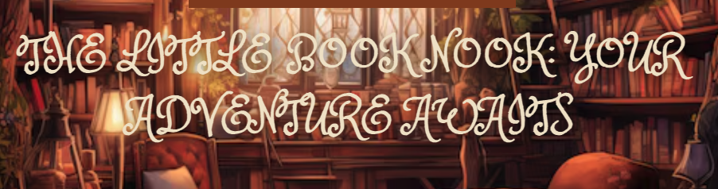

# The Little Book Nook

**The Little Book Nook** is a platform where users can upload children book recommendations, and add comments

## Getting Started

To get started with the project, please follow the links below:
- **Trello Board**: [Trello Link](https://trello.com/b/X0JUlXeD/children-book-review)
- **Deployed Link **: 

## Key Attributes
- Class and Lecture Notes
- Django Documents

## Technologies Used

- CSS
- JavaScript
- Heroku
- ChatGPT

## Future Iterations

In future iterations, we plan to introduce the following features:

- Allow users to edit and delete their comments.
- Improve css
- can like reviews
- create categories for book types and have filters

